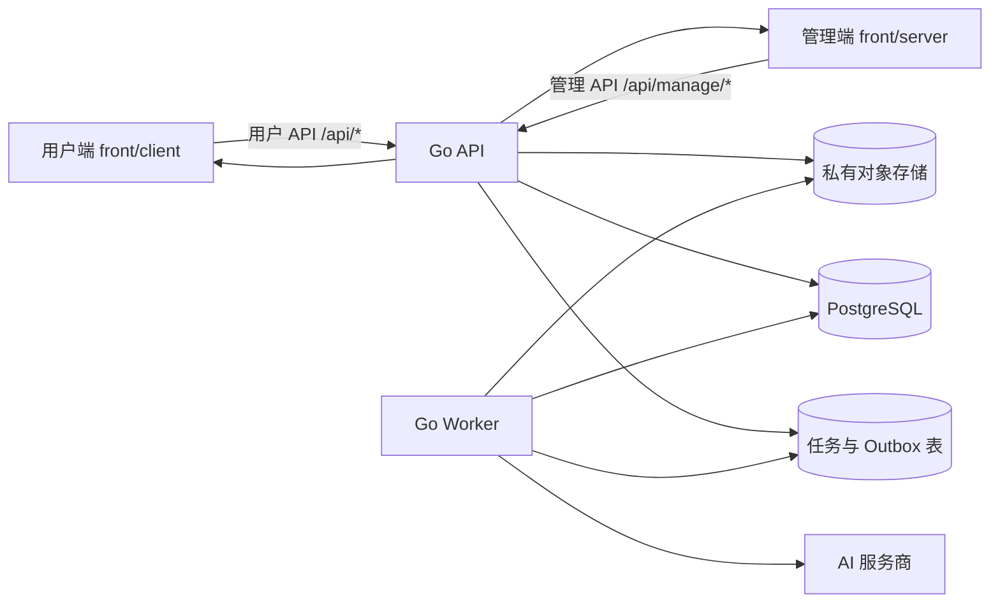
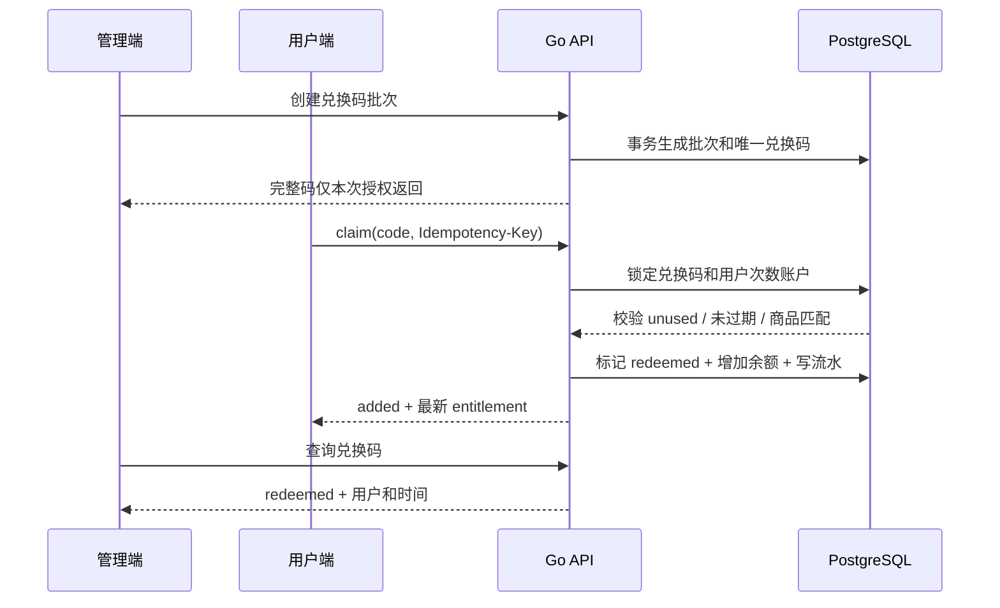
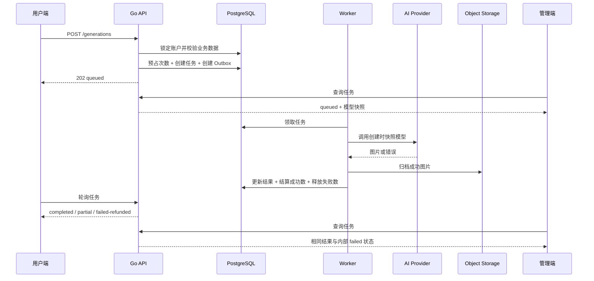

# 映研平台后端 PRD

- 文档版本：v0.1
- 更新日期：2026-07-30
- 适用目录：`backend`
- 技术基线：Go、Gin、GORM、PostgreSQL、S3 兼容对象存储
- 本地运行环境：macOS + Docker Desktop
- 对接前端：`front/client` 用户端、`front/server` 管理端
- 当前阶段：后端需求与技术边界设计，不包含编码实现
- 相关文档：
  - [用户端 PRD](./clientPrd.md)
  - [管理端 PRD](./serverPrd.md)
  - [用户端 API 契约](../frontApi/clientApi.md)
  - [管理端 API 契约](../frontApi/serverApi.md)

## 0. 文档结论

映研后端不是单纯的 AI API 转发层，而是用户端、管理端和后端三端之间唯一可信的
数据与状态中心。

正式环境中，以下数据只能由后端和数据库维护：

- 用户账号和登录 Session。
- 管理账号、角色和权限。
- 兑换码、生成批次和核销状态。
- 用户可用次数、预占记录和不可修改流水。
- 用户原图、参考图、AI 成片和人工成片元数据。
- 提示词优化版本和用户确认快照。
- AI 服务商、模型、密钥和平台模型绑定。
- AI 生成任务、执行进度、模型快照和退款结果。
- 人工修图工单、报价、交付、返修和状态时间线。
- 管理操作和敏感数据访问审计。

`front/client` 和 `front/server` 当前使用两套彼此独立的 MSW/LocalStorage Mock。
正式后端上线后，两端 Mock 必须退出业务数据链路，所有业务页面统一读取同一后端。

## 1. 项目背景

映研面向从咸鱼购买 AI 图片服务的用户。

用户完成购买后获得兑换码和 Web 地址，在用户端注册、兑换次数、上传图片、优化提示词、
创建 AI 任务，并在不满意 AI 成片时申请人工修图。

平台管理员通过管理端生成兑换码、配置 AI 服务商和模型、管理用户次数、查看任务和图片、
处理人工工单及审计平台操作。

当前两个前端项目已经具备完整的 Mock 交互，但 Mock 数据存在以下天然限制：

1. 管理端生成的兑换码不能在用户端兑换。
2. 管理端调整的次数不会改变用户端余额。
3. 用户端创建的任务和工单不会自动出现在管理端。
4. 管理端切换模型不会影响用户端后续任务。
5. 两端无法依靠 LocalStorage 保证事务、行锁、幂等和并发正确性。
6. 图片、密钥、完整兑换码和密码没有真实的安全存储。

因此，后端第一目标不是增加更多功能，而是建立统一、可靠、可追溯的数据闭环。

## 2. 产品目标与非目标

### 2.1 核心目标

1. 为用户端和管理端提供统一的 `/api` 服务。
2. 保证三个端看到的用户、余额、任务、工单和资产数据一致。
3. 保证兑换、扣次、预占、退款和人工调整在并发情况下仍然正确。
4. 将 AI Base URL、API Key 和模型路由完全收口到后端。
5. 通过异步任务执行 AI 请求，避免浏览器等待长连接。
6. 保证已提交任务使用创建时的模型快照，不受后续模型切换影响。
7. 让所有管理写操作和敏感查看可以审计。
8. 使用容易阅读和维护的 Go 分层结构，避免不必要的抽象。
9. 支持在用户的 macOS Docker Desktop 中一键启动本地依赖。

### 2.2 非目标

1. v0.1 不接入咸鱼订单、支付或自动退款。
2. 不重复建设已有的 AI API 转发和成本管理系统。
3. 不做微服务拆分。
4. 不做自动跨服务商故障转移。
5. 不做按用户、套餐或用户组分流模型。
6. 不做网页版 Photoshop 或图片局部编辑器。
7. 不做复杂的自定义角色和权限编辑器。
8. 不做工单自动分派。
9. 不做通用双重记账或财务系统。
10. v0.1 不强制使用 WebSocket 或 SSE，继续兼容前端轮询。

## 3. 三端边界

### 3.1 三端定义

| 端 | 项目目录 | 主要职责 |
| --- | --- | --- |
| 用户端 | `front/client` | 注册登录、兑换、创作、任务、人工修图记录 |
| 管理端 | `front/server` | 兑换码、AI 配置、用户、任务、资产、工单和审计 |
| 后端 | `backend` | 权限、数据库事务、AI 执行、对象存储和统一业务规则 |

### 3.2 总体数据流



### 3.3 唯一事实源

1. PostgreSQL 是业务状态的唯一事实源。
2. 对象存储保存文件内容，数据库保存文件元数据、归属和引用关系。
3. Redis、内存缓存或浏览器缓存不得作为余额、兑换码状态或任务状态的事实源。
4. 前端传回的用户 ID、余额、成本、图片 URL、提示词确认时间和任务状态均不可信。
5. 后端必须根据当前 Session 和数据库记录重新校验。

### 3.4 三端一致性级别

| 数据 | 一致性要求 | 说明 |
| --- | --- | --- |
| 兑换码核销 | 强一致 | 同一码并发只能一个请求成功 |
| 次数余额 | 强一致 | 不能出现负余额、重复扣减或重复退款 |
| 管理写操作 | 强一致 | 成功返回后其他端立即能读取新状态 |
| AI 执行进度 | 最终一致 | Worker 更新后在下一次轮询中可见 |
| 图片签名 URL | 临时投影 | URL 可变化，图片资产 ID 和归属不变 |
| Dashboard 统计 | 短暂最终一致 | 可允许秒级统计延迟，不影响业务事务 |

### 3.5 跨端闭环要求

| 起点操作 | 另一端必须看到的结果 |
| --- | --- |
| 管理端生成兑换码 | 用户端可以立即兑换 |
| 用户端成功兑换 | 管理端码状态、用户余额和流水同时更新 |
| 用户端创建 AI 任务 | 管理端任务列表可以立即查询到 |
| Worker 更新任务 | 用户端和管理端返回同一进度及结算结果 |
| 用户端提交人工工单 | 管理端工单列表可以立即查询到 |
| 管理端报价、开工或交付 | 用户端人工修图记录在下一次轮询中更新 |
| 管理端调整用户次数 | 用户端下一次权益请求返回最新余额 |
| 管理端停用用户 | 用户现有 Session 立即失效 |
| 管理端切换平台模型 | 只影响切换后新建的 AI 任务 |
| 管理端清理图片 | 文件不可再访问，但业务元数据和审计仍保留 |

## 4. 技术方案

### 4.1 技术栈

| 层 | 选择 | 原因 |
| --- | --- | --- |
| 语言 | Go | 部署简单、并发和后台任务能力适合本项目 |
| HTTP | Gin | 路由和中间件直观，代码量较少 |
| ORM | GORM | 满足用户指定，支持事务、关联和行锁 |
| 数据库 | PostgreSQL | 支持事务、唯一约束、行锁和 JSON 字段 |
| 对象存储 | MinIO / S3 Compatible | 本地使用 MinIO，生产可替换为 S3 兼容服务 |
| 日志 | Go `slog` 或简单结构化日志 | 不额外引入复杂日志框架 |
| 配置 | 环境变量 | Docker 与生产部署方式一致 |
| API 文档 | OpenAPI | 作为两个前端和后端的联调基线 |

Go 和依赖版本在创建项目时选择稳定版本，并通过 `go.mod` 固定，不在 PRD 中追随浮动版本。

### 4.2 架构选择

v0.1 使用模块化单体，不拆微服务：

```text
HTTP Handler
  -> Domain Service
    -> GORM Model / Query
      -> PostgreSQL
```

复杂操作的数据库事务只能放在 Service 层，Handler 不直接更新多个表。

AI Worker 与 API 使用同一套领域 Service 和 GORM Model，但以独立进程运行：

```text
cmd/api
cmd/worker
```

### 4.3 简单编码原则

1. 不为每张表创建通用泛型 Repository。
2. 不引入依赖注入框架，使用普通构造函数传递依赖。
3. 不使用反射实现通用业务状态机。
4. 路由 Handler 只负责解析、校验和返回响应。
5. Service 负责权限、事务、状态流转和业务错误。
6. GORM Model 不直接作为 API DTO 返回。
7. 状态、角色、错误码和业务类型使用具名常量。
8. 一个函数只处理一个明确业务动作。
9. 优先写清晰的重复代码，不为了少量重复制造难懂抽象。
10. 必要复杂度只保留在事务、幂等、任务和权限边界。

### 4.4 本地 Docker 组成

本地通过 Docker Desktop 启动：

| 服务 | 用途 |
| --- | --- |
| `postgres` | 业务数据库 |
| `minio` | 私有图片对象存储 |
| `api` | Go HTTP API |
| `worker` | AI 和清理任务 Worker |

v0.1 默认不要求 Redis。

Session、幂等记录和任务队列先存 PostgreSQL。后续并发量明显增加时，再引入 Redis，
避免本地开发同时维护过多基础服务。

Docker 要求：

1. 提供 `compose.yaml`。
2. PostgreSQL 和 MinIO 使用具名 Volume。
3. 所有服务提供 Healthcheck。
4. 提供 `.env.example`，不提交真实密码和 API Key。
5. API 默认监听 `8080`。
6. Client 与管理端开发代理统一转发 `/api` 到 `http://127.0.0.1:8080`。
7. Worker 可独立重启，重启后继续处理未完成任务。
8. 本地提供显式的演示数据初始化命令，不在生产自动插入演示数据。

## 5. 身份、Session 与权限

### 5.1 认证 Realm

当前两个前端都调用 `/api/auth/login`、`/api/auth/session` 和 `/api/auth/logout`，
但用户端期待 `User`，管理端期待 `AdminSession`。同域部署还会发生 Cookie 冲突。

后端正式契约采用两个认证 Realm：

| Realm | 路径 | Cookie 建议 |
| --- | --- | --- |
| 普通用户 | `/api/auth/*` | `yingyan_user_session` |
| 管理账号 | `/api/manage/auth/*` | `yingyan_manage_session` |

这需要在正式联调前将管理端认证 Service 从 `/api/auth/*` 调整为
`/api/manage/auth/*`。

### 5.2 用户账号

普通用户：

- 通过用户端公开注册。
- 邮箱执行 `trim` 和小写标准化。
- 同一 Realm 内邮箱唯一。
- 密码至少 8 位。
- 必须记录同意的协议版本和时间，而不只保存布尔值。
- 状态为 `active` 或 `disabled`。
- 停用后不能登录、兑换、上传、生成或创建人工工单。

### 5.3 管理账号

管理端不开放注册。

v0.1 管理角色：

```text
platform_admin
retouch_operator
```

权限由角色固定映射：

| 角色 | 权限 |
| --- | --- |
| `platform_admin` | `platform:manage`、`retouch:manage` |
| `retouch_operator` | `retouch:manage` |

不建立通用权限配置页面。后端 Session DTO 仍返回权限数组，便于前端路由初始化。

第一个平台管理员通过本地初始化命令或一次性启动配置创建，不能通过公开 API 提升权限。

### 5.4 密码和 Session

1. 密码只能保存可靠的密码哈希。
2. Session Cookie 必须为 `HttpOnly`。
3. HTTPS 环境设置 `Secure`。
4. Cookie 设置合适的 `SameSite`。
5. Session Token 在数据库中只保存摘要。
6. 普通用户和管理员 Session 分开保存和吊销。
7. 用户或管理员停用、密码重置后，立即吊销全部已有 Session。
8. 登录、注册和 Session 创建需要限流。
9. 管理写操作必须校验 CSRF Token 或严格校验 Origin。

建议默认有效期：

- 普通用户不保持登录：24 小时。
- 普通用户保持登录：30 天。
- 管理员不保持登录：8 小时。
- 管理员保持登录：7 天。

有效期通过环境变量配置。

### 5.5 管理重置密码

管理端当前支持生成临时密码，但用户端尚未实现强制改密页面。

因此：

1. 后端可以实现临时密码和 30 分钟有效期。
2. 临时密码只返回一次。
3. 使用临时密码登录后必须进入强制改密状态。
4. 在 Client 增加强制改密页面前，该功能不得作为正式可交付闭环验收项。

## 6. API 通用规范

### 6.1 基础路径

```text
用户业务：/api/*
管理业务：/api/manage/*
内部 Worker：不暴露公共管理接口
```

### 6.2 统一响应

成功：

```ts
interface ApiSuccessResponse<T> {
  code: 0
  data: T
}
```

失败：

```ts
interface ApiErrorResponse {
  code: number
  message: string
  details?: unknown
}
```

要求：

1. 只有 `code === 0` 表示成功。
2. 使用符合错误语义的 HTTP 状态码。
3. 无业务数据时返回 `data: null`。
4. 不返回 GORM Model、数据库字段名或对象存储内部路径。
5. `details` 只能放前端可以安全展示或处理的信息。

### 6.3 通用请求头

| 请求头 | 用途 |
| --- | --- |
| `X-Request-Id` | 前后端请求追踪 |
| `Idempotency-Key` | 写操作防重复 |
| `X-CSRF-Token` | Cookie Session 的管理写操作保护 |

后端应在响应头回传 `X-Request-Id`。

### 6.4 幂等

幂等唯一范围：

```text
principal realm
+ principal id
+ HTTP method
+ request path
+ Idempotency-Key
```

幂等记录至少包含：

- 身份和 Realm。
- 方法和路径。
- 幂等键。
- 规范化请求摘要。
- 第一次成功结果引用。
- HTTP 状态和业务错误码。
- 创建和过期时间。

规则：

1. 相同键和相同请求返回第一次结果。
2. 相同键但请求体不同返回 `409/4002`。
3. 幂等结果至少保留 24 小时。
4. 幂等记录必须与业务写操作在同一个事务中提交。
5. 不在幂等表明文保存完整兑换码、API Key、临时密码或签名 URL。
6. 敏感结果保存资源 ID，重试时重新执行授权投影。

### 6.5 分页与排序

管理端列表统一返回：

```ts
interface PageResult<T> {
  items: T[]
  page: number
  pageSize: number
  total: number
  hasMore: boolean
}
```

- 默认 `page=1`、`pageSize=20`。
- `pageSize` 最大 `100`。
- 默认按最近更新时间倒序。

用户端现有任务和工单接口返回数组。v0.1 为兼容当前 Client 暂时保留，数据库查询仍需
支持分页条件。后续升级为游标分页时单独更新 Client API 契约。

### 6.6 时间和数量

1. API 时间统一返回 ISO 8601 UTC。
2. 数据库存储使用带时区时间。
3. 次数、数量、页码均使用整数。
4. 图片宽高和文件大小使用整数。
5. 所有状态判断使用服务端时间。

## 7. 数据模型

### 7.1 基础字段

核心表统一包含：

- `id`：UUID 或 ULID 字符串。
- `created_at`。
- `updated_at`。
- 必要状态表增加 `version`，用于并发状态更新。

不默认对所有业务表使用软删除。兑换、流水、任务、工单和审计原则上不能删除。

### 7.2 核心实体

| 模块 | 主要表 |
| --- | --- |
| 用户认证 | `users`、`user_sessions` |
| 管理认证 | `admin_accounts`、`admin_sessions` |
| 次数 | `credit_accounts`、`credit_reservations`、`credit_ledger_entries` |
| 兑换码 | `redemption_batches`、`redemption_codes`、`redemption_claims` |
| 图片 | `assets`、`asset_relations` |
| 提示词 | `prompt_versions` |
| AI 配置 | `ai_providers`、`ai_models`、`platform_model_bindings`、`model_test_runs` |
| AI 任务 | `generation_tasks`、`generation_task_assets`、`generation_outputs` |
| AI 执行 | `generation_jobs`、`provider_attempts`、`outbox_events` |
| 人工工单 | `retouch_tickets`、`retouch_quotes`、`retouch_revisions` |
| 人工文件 | `retouch_selected_results`、`retouch_deliverables` |
| 工单历史 | `retouch_events` |
| 平台基础 | `idempotency_records`、`audit_logs` |

### 7.3 GORM Model 与 DTO

GORM Model 可以包含：

- 数据库外键。
- 加密密文。
- 内部错误信息。
- 对象存储 Key。
- 行版本。

API DTO 必须排除：

- 密码哈希。
- Session Token 摘要。
- API Key 密文。
- 完整兑换码摘要。
- 对象存储 Bucket 和 Key。
- 内部 Provider 请求头。
- 未脱敏错误响应。

禁止直接使用 `db.Model(&model).Updates(payload)` 将前端请求体写入数据库。

## 8. 次数账户

### 8.1 数据对象

`credit_accounts`：

- `user_id`，唯一。
- `balance`，当前可用于新请求的次数。
- `version`，并发控制。

`credit_reservations`：

- `user_id`。
- `business_type`：`generation` 或 `retouch`。
- `business_id`。
- `amount`。
- `settled_amount`。
- `released_amount`。
- `refunded_amount`。
- `status`。
- `settled_at`、`released_at`、`refunded_at`。

`credit_ledger_entries`：

- `user_id`。
- `type`。
- `amount`。
- `balance_before`。
- `balance_after`。
- `business_type` 和 `business_id`。
- `operator_id`。
- `reason` 和关联编号。
- `created_at`。

### 8.2 流水类型

内部流水使用：

```text
redemption
reserve
release
refund
adjustment
```

说明：

- `reserve`：从可用余额中预占，`amount` 为负数。
- `release`：业务尚未结算时释放预占，`amount` 为正数。
- `refund`：业务结算后因平台失败退回，`amount` 为正数。
- `adjustment`：管理员人工增加或减少。
- 预占变为结算时不再次修改可用余额，不新增伪造的负数余额流水。

Client API 需要在正式联调前增加 `reserve`、`release` 和 `adjustment` 展示类型。

### 8.3 不变量

1. `credit_accounts.balance >= 0`。
2. 任何余额变化都有且只有一条流水。
3. `balance_after = balance_before + amount`。
4. 相同业务不能存在两个有效预占。
5. 相同退款事件不能执行两次。
6. 只有次数 Service 可以更新余额。
7. 管理员不能直接修改余额字段。
8. 预占金额满足：

```text
settled_amount + released_amount <= amount
refunded_amount <= settled_amount
```

9. 业务净消费为：

```text
net_spent = settled_amount - refunded_amount
```

10. 终态生成任务满足：

```text
reservedCredits = spentCredits + refundedCredits
```

### 8.4 事务和行锁

涉及余额的 Service 必须使用 GORM 事务并锁定账户：

```text
SELECT credit account FOR UPDATE
```

实现时使用 GORM `clause.Locking`，不要依赖前端按钮禁用或先查询后更新。

## 9. 兑换码与生成批次

### 9.1 批次

批次字段：

- 批次名称。
- 生成数量，1 到 500。
- 每码次数，正整数。
- 商品标识。
- 指定过期时间或永久有效。
- 内部备注。
- 创建管理员和时间。

单个兑换码也通过数量为 1 的批次生成。

### 9.2 兑换码安全存储

完整码格式：

```text
YY-XXXX-XXXX-XXXX
```

要求：

1. 使用密码学安全随机数。
2. 排除 `0/O`、`1/I` 等易混淆字符。
3. 标准化为 `trim + uppercase`。
4. 保存带服务端 Pepper 的确定性摘要，用于精确核销查询。
5. 保存加密密文，仅用于平台管理员授权 Reveal 和 Export。
6. 不保存可被普通数据库搜索直接获得的明文码。
7. 摘要建立唯一索引。

### 9.3 状态

数据库保存事实字段：

- `redeemed_at`、`redeemed_by`。
- `disabled_at`、`disabled_by`、`disabled_reason`。
- `expires_at`。

API 状态按以下优先级推导：

```text
redeemed > disabled > expired > unused
```

### 9.4 核销事务



同一个事务内完成：

1. 幂等校验。
2. 标准化并查找摘要。
3. 锁定兑换码和用户账户。
4. 校验状态、过期和商品。
5. 标记核销用户和时间。
6. 增加余额。
7. 写入兑换流水。
8. 写入核销记录。
9. 提交事务。

兑换与管理员失效并发时，只有一个操作成功。

### 9.5 Reveal、Export、失效和延期

- 只有平台管理员可以 Reveal 或 Export。
- 完整码响应设置 `Cache-Control: no-store`。
- Reveal 和 Export 记录敏感读取审计。
- 失效只影响 `unused`。
- `disabled` 不可恢复。
- `expired` 且未显式失效可以延期。
- `redeemed` 不能撤销、失效或延期。
- 批量操作返回 `affected`、`skipped` 和 `failed`。

## 10. 图片资产

### 10.1 类型

```text
source
reference
retouch-reference
ai-result
retouch-result
```

参考图用途：

```text
style
composition
person
detail
```

### 10.2 上传

用户上传：

- JPG、PNG、WebP。
- 单张最大 15MB。
- 一个创作任务最多关联 8 张素材。

人工交付：

- 1 到 4 张。
- JPG、PNG、WebP。
- 单张最大 30MB。

后端必须：

1. 校验声明 MIME 和真实文件头。
2. 尝试解码图片，拒绝损坏文件和图片炸弹。
3. 校验文件大小、像素上限和数量。
4. 生成服务端资产 ID 和对象存储 Key。
5. 记录所有者、类型、宽高、大小和哈希。
6. 上传成功后再提交业务关联。
7. 失败时清理未引用的对象。

v0.1 可以继续接收 `multipart/form-data`，但必须流式写入对象存储，不能将最多 120MB
人工交付文件整体读入内存。

上传接口使用独立超时，不沿用前端普通 JSON 请求的 20 秒超时。后续可升级为预签名直传。

### 10.3 所有权和引用

1. 用户只能使用自己的素材。
2. 生成请求只接收和信任素材 ID。
3. `source`、`reference` 和 `retouch-reference` 用途由数据库记录决定。
4. 已被任务或工单引用的素材不能由用户直接删除。
5. AI 结果和人工结果由后端或 Worker 创建，不能伪造。
6. 修图操作员只能获取当前工单需要的资产投影。

### 10.4 访问

- 对象存储 Bucket 默认为私有。
- API 返回短期签名 URL。
- URL 过期后由详情接口重新生成。
- URL 不写入业务表、审计快照或普通日志。
- 下载前先执行用户归属或管理数据范围校验。

### 10.5 留存

1. 任务进入终态后默认保留 90 天。
2. 存在人工工单时，从最后一个工单进入终态后重新计算 90 天。
3. 长期保留阻止自动清理。
4. 提前清理需要原因、二次确认和审计。
5. 运行中任务、非终态工单和长期保留资产不能清理。
6. 文件清理后保留资产元数据、关联关系和审计。

## 11. 提示词

### 11.1 版本

提示词版本包含：

- 当前用户。
- 原始需求。
- 工作模式。
- 七个分区内容。
- 参与优化的素材 ID 快照。
- 使用的对话模型和配置版本。
- 状态：`draft` 或 `confirmed`。
- 创建和确认时间。

确认时间必须由服务端写入。

已确认版本不可修改。用户修改内容后创建新版本，避免历史任务提示词被覆盖。

### 11.2 优化输入

当前前端只发送：

```json
{
  "source": "...",
  "mode": "image-to-image"
}
```

该结构无法实现“参考示例图某个位置”的核心需求。

正式接口应增加：

```text
sourceAssetIds
referenceAssetIds
referenceRoles
```

后端重新校验图片归属和用途，再将必要图片提供给支持视觉输入的对话模型。

### 11.3 对话模型能力

对话模型能力至少区分：

```text
promptOptimization
visionInput
```

- 文生图纯文本优化只要求 `promptOptimization`。
- 带原图或参考图的优化同时要求 `visionInput`。
- 模型能力不足时，在优化请求阶段返回明确错误，不进入生成阶段。

### 11.4 费用

v0.1 提示词优化免费，但必须限流并记录模型调用和结果状态。

后续如改为收费，只调整后端策略和报价结果，不在前端写死。

## 12. AI 服务商、模型和平台绑定

### 12.1 服务商

字段：

- 名称和唯一编码。
- 协议类型，v0.1 为 `openai-compatible`。
- Base URL。
- 加密 API Key。
- 启用状态。
- 连接状态和最近测试摘要。
- 配置版本。
- 内部备注。

### 12.2 密钥

1. API Key 使用应用主密钥或 KMS 进行加密。
2. API 只返回掩码。
3. 保存后不能重新读取完整值。
4. 轮换时覆盖为新密钥并增加配置版本。
5. 密钥不进入日志、审计和错误上报。
6. 应用主密钥通过环境变量或 Secret 注入，不进入数据库。

### 12.3 Base URL 安全

连接测试和任务执行必须：

1. 默认只允许 HTTPS。
2. 拒绝回环、内网、链路本地和云元数据地址。
3. 解析 DNS 后再次校验实际目标 IP。
4. 重定向后重新校验地址。
5. 设置连接、请求和整体超时。
6. 限制响应体大小。
7. 对错误信息脱敏。

### 12.4 模型

聊天模型能力：

- 提示词优化。
- 视觉输入。

生图模型能力：

- 文生图。
- 图生图或图片编辑。

模型类型创建后不可直接修改。

修改模型 ID、能力、Base URL 或 API Key 后：

- 增加配置版本。
- 旧测试结果变为 `untested`。
- 当前绑定可以保留引用，但平台 Ready 状态变为不可用。
- 新任务在重新测试成功前拒绝创建。
- Dashboard 必须显示当前能力异常。

### 12.5 平台绑定

绑定类型：

```text
chat
image
```

每种类型最多一条当前绑定，通过数据库唯一约束保证。

绑定前校验：

- 服务商启用。
- 服务商连接测试成功。
- 模型启用。
- 模型测试成功。
- 能力满足平台要求。

生图平台模型必须同时支持文生图和图生图。

提示词优化需要图片上下文时，当前聊天模型必须支持视觉输入。

### 12.6 Provider Adapter

业务 Service 只调用统一能力：

```text
OptimizePrompt
GenerateTextToImage
GenerateImageToImage
TestConnection
TestModel
```

OpenAI Compatible 的具体路径、请求和响应解析放在 Adapter 内，不写入任务 Service。

Client 永远不能获取 Provider Base URL、API Key 或真实内部请求。

## 13. AI 生成任务

### 13.1 创建请求

当前 Client 发送完整 `PromptVersion` 和 `Asset[]`。后端只能信任其中的 ID。

正式创建时重新读取并校验：

- 当前用户和状态。
- 提示词版本属于当前用户且已确认。
- 素材属于当前用户。
- 图生图至少一张 `source`。
- 素材数量和用途合法。
- 输出数量 1 到 4。
- 比例和参考强度合法。
- 当前平台模型 Ready。
- 模型支持当前模式。
- 用户余额足够。

正式后端必须拒绝 `mockScenario` 等 Mock 专用字段。

### 13.2 创建事务



同一个事务内：

1. 校验幂等。
2. 锁定次数账户。
3. 创建次数预占。
4. 减少可用余额并写 `reserve` 流水。
5. 创建 `generation_tasks`。
6. 保存服务商、模型和配置版本快照。
7. 创建任务资产关联。
8. 创建 Outbox 或 Job 记录。
9. 提交事务。

### 13.3 状态

数据库统一使用：

```text
queued
processing
completed
partial
failed
cancelled
```

Client 当前使用 `failed-refunded`，管理端使用 `failed`。

v0.1 后端兼容方式：

- 数据库存储 `failed`。
- 当 `failed` 且退款完成时，用户端 DTO 返回 `failed-refunded`。
- 管理端 DTO 返回 `failed` 和 `refundedCredits`。
- 后续两个前端统一状态时再移除 DTO 映射。

### 13.4 Worker

1. Worker 从 PostgreSQL Job 表领取任务。
2. 使用行锁和 `SKIP LOCKED` 防止多个 Worker 重复领取。
3. 领取后记录 `started_at`、Worker ID 和心跳。
4. 已被取消的排队任务不能执行。
5. Provider 返回的图片必须先归档到映研对象存储。
6. 只有归档成功的图片计为成功结果。
7. Worker 更新任务、结果和次数结算时使用事务。
8. Worker 重启后可以恢复未完成 Job。

### 13.5 Provider 重试

v0.1 不自动切换其他服务商。

仅在能够确认请求尚未被 Provider 接收时进行有限重试。

如果超时后无法判断 Provider 是否已经计费或生成：

- 不盲目重复请求。
- 记录 `provider_attempt` 和脱敏错误。
- 将任务进入可追踪失败状态。
- 按平台失败规则退款用户。
- 管理端显示需要人工检查的异常。

### 13.6 结算

每张成功输出消耗 1 次：

| 结果 | 结算 |
| --- | --- |
| 全部成功 | 全部预占结算 |
| 部分成功 | 成功部分结算，失败部分释放 |
| 全部失败 | 全部释放或退款 |
| 排队取消 | 全部释放 |

结算事务必须保证只执行一次。

### 13.7 取消

- 仅 `queued` 可以取消。
- API 锁定任务和预占记录。
- 状态变为 `cancelled`。
- 全额释放预占。
- 写 `release` 流水。
- 已被 Worker 领取为 `processing` 后不能取消。

## 14. 人工修图工单

### 14.1 创建资格

用户只能从自己的 AI 任务创建工单：

- 任务为 `completed` 或 `partial`。
- 至少存在一张成功结果。
- 选择 1 到 4 张属于该任务的结果。
- 要求为 1 到 1000 字。
- 补充素材最多 4 张，且类型为 `retouch-reference`。
- 同一任务同时最多一个非终态有效工单。

创建工单不扣次数。

### 14.2 状态机

```text
submitted
  ├─ 报价 -> quote_pending
  ├─ 拒单 -> rejected
  └─ 用户取消 -> cancelled

quote_pending
  ├─ 重新报价 -> quote_pending
  ├─ 用户接受 -> accepted
  ├─ 拒单 -> rejected
  └─ 用户取消 -> cancelled

accepted
  ├─ 开工 -> processing
  ├─ 用户取消 -> cancelled + 释放预占
  └─ 履约失败 -> rejected + 释放预占

processing
  ├─ 交付 -> awaiting_confirmation
  └─ 履约失败 -> rejected + 退款

awaiting_confirmation
  ├─ 用户确认 -> delivered
  ├─ 唯一一次返修 -> processing
  └─ 履约失败 -> rejected + 退款
```

终态：

```text
delivered
rejected
cancelled
```

`rejected` 同时承载开工前拒单和履约失败。数据库必须额外保存关闭类型：

```text
rejected_before_accept
fulfillment_failed
```

Client 可以继续显示统一的“已拒绝”，管理端详情和审计需要根据关闭类型展示真实原因。

### 14.3 工单编号和报价

- 工单编号全局唯一且适合人工沟通。
- 报价为 1 到 999 的整数。
- 重新报价创建新的 Quote ID。
- 旧 Quote ID 立即失效。
- 接受报价时必须提交当前 Quote ID。
- 报价说明最多 500 字。

### 14.4 次数事务

用户接受报价：

1. 锁定工单、当前报价和次数账户。
2. 校验工单仍为 `quote_pending`。
3. 校验 Quote ID。
4. 校验余额。
5. 创建人工工单预占。
6. 减少余额并写 `reserve` 流水。
7. 状态变为 `accepted`。

管理员开工：

1. 锁定工单和预占。
2. 只允许 `accepted`。
3. 将预占标记为已结算。
4. 设置 `spentCredits`。
5. 不再次减少余额，不伪造第二条负数流水。
6. 状态变为 `processing`。

取消或失败：

- 开工前取消：释放预占，写 `release`。
- 开工前履约失败：释放预占，写 `release`。
- 开工后履约失败：退回已结算次数，写 `refund`。
- 相同工单只能成功释放或退款一次。

### 14.5 工单数据范围

平台管理员可以查看完整业务链路。

修图操作员只能查看：

- 工单基本信息。
- 用户邮箱和账号状态摘要。
- 用户要求。
- 被选中的 AI 结果。
- 完成履约必要的原图和参考图。
- 补充素材。
- 当前报价、返修要求和时间线。

不能向修图操作员返回与工单无关的：

- 用户余额和全部流水。
- 其他任务。
- 其他图片。
- 完整提示词历史。
- AI 服务商密钥和内部路由。

### 14.6 并发

v0.1 不做工单分派，多个修图操作员共享队列。

报价、开工、交付、拒单和失败操作必须锁定工单，并根据当前状态更新。

推荐更新条件同时包含：

```text
ticket id + expected status + version
```

状态已被其他操作员改变时返回 `409/7004`。

### 14.7 未定义自动期限

现有产品需求没有定义：

- 报价自动过期时间。
- 用户接受报价后的自动取消时间。
- 人工交付后的自动确认时间。

v0.1 默认不自动过期或自动确认，由用户或管理员明确操作。后续增加期限时单独更新状态机。

## 15. 用户与管理数据

### 15.1 用户停用

停用事务或后续动作必须：

- 更新用户状态和原因。
- 吊销用户 Session。
- 拒绝新的兑换、上传、生成和工单操作。
- 保留余额、任务、工单、图片和流水。
- 写入审计。

### 15.2 人工调次

- 仅平台管理员。
- 调整数为非零整数。
- 原因必填。
- 可填写咸鱼订单号或工单号。
- 调整后不能为负数。
- 锁定次数账户。
- 余额、`adjustment` 流水和审计在同一事务完成。
- 不通过修改兑换码状态模拟扣次。

### 15.3 任务与提示词管理

管理端只能查看任务业务数据，不能直接修改：

- 用户原始要求。
- 优化和确认提示词。
- 任务状态。
- 次数结算。
- 模型快照。
- AI 结果。

修复异常必须通过明确的后端业务动作，不提供通用“编辑数据库记录”接口。

## 16. 审计

### 16.1 必须审计

- 完整兑换码 Reveal、复制和导出。
- 兑换码和批次生成、失效、延期。
- AI 服务商创建、修改、启停和密钥轮换。
- 模型创建、修改、测试和平台绑定切换。
- 用户启停、密码重置和次数调整。
- 图片签名下载、长期保留和提前清理。
- 工单报价、开工、交付、拒单和退款。
- 管理角色变化。

### 16.2 字段

- 审计 ID。
- 管理员 ID、邮箱和角色。
- 动作。
- 资源类型和资源 ID。
- 脱敏前后摘要。
- 原因。
- 成功或失败。
- 请求 ID。
- IP 和设备摘要。
- 时间。

### 16.3 规则

1. 审计只追加，不编辑、不删除。
2. 成功和失败管理操作都记录。
3. 业务事务回滚后，失败审计仍应保留。
4. API Key、完整兑换码、密码、Token、签名 URL 必须递归脱敏。
5. 在线审计至少保留 365 天。
6. 修图操作员只能查看本人操作摘要。
7. 平台管理员可以查看全部审计。

## 17. API 范围

### 17.1 用户端

认证：

- `POST /api/auth/register`
- `POST /api/auth/login`
- `GET /api/auth/session`
- `POST /api/auth/logout`
- `GET /api/me`

次数与兑换：

- `GET /api/entitlements`
- `GET /api/usage/ledger`
- `POST /api/usage/quote`
- `POST /api/redemptions/claim`

素材与提示词：

- `POST /api/assets`
- `DELETE /api/assets/:assetId`
- `POST /api/prompts/optimize`
- `POST /api/prompts/confirm`

生成任务：

- `POST /api/generations`
- `GET /api/tasks`
- `GET /api/tasks/:taskId`
- `POST /api/tasks/:taskId/cancel`

人工工单：

- `GET /api/retouch-tickets`
- `GET /api/retouch-tickets/:ticketId`
- `POST /api/tasks/:taskId/retouch-tickets`
- `POST /api/retouch-tickets/:ticketId/quote/accept`
- `POST /api/retouch-tickets/:ticketId/cancel`
- `POST /api/retouch-tickets/:ticketId/revisions`
- `POST /api/retouch-tickets/:ticketId/confirm`

### 17.2 管理端

认证：

- `POST /api/manage/auth/login`
- `GET /api/manage/auth/session`
- `POST /api/manage/auth/logout`

Dashboard：

- `GET /api/manage/dashboard`

兑换码：

- `GET /api/manage/redemption-codes`
- `GET /api/manage/redemption-codes/:codeId`
- `GET /api/manage/redemption-batches`
- `GET /api/manage/redemption-batches/:batchId`
- `POST /api/manage/redemption-batches`
- `POST /api/manage/redemption-codes/:codeId/reveal`
- `POST /api/manage/redemption-batches/:batchId/reveal`
- `POST /api/manage/redemption-batches/:batchId/export`
- `POST /api/manage/redemption-codes/disable`
- `POST /api/manage/redemption-codes/extend`

AI 服务：

- `GET /api/manage/ai-providers`
- `POST /api/manage/ai-providers`
- `PATCH /api/manage/ai-providers/:providerId`
- `POST /api/manage/ai-providers/:providerId/test`
- `POST /api/manage/ai-providers/:providerId/rotate-key`
- `GET /api/manage/ai-models`
- `POST /api/manage/ai-models`
- `PATCH /api/manage/ai-models/:modelId`
- `POST /api/manage/ai-models/:modelId/test`
- `GET /api/manage/platform-model-bindings`
- `POST /api/manage/platform-model-bindings`

人工工单：

- `GET /api/manage/retouch-tickets`
- `GET /api/manage/retouch-tickets/:ticketId`
- `POST /api/manage/retouch-tickets/:ticketId/quote`
- `POST /api/manage/retouch-tickets/:ticketId/start`
- `POST /api/manage/retouch-tickets/:ticketId/deliver`
- `POST /api/manage/retouch-tickets/:ticketId/reject`
- `POST /api/manage/retouch-tickets/:ticketId/fail`

用户和次数：

- `GET /api/manage/users`
- `GET /api/manage/users/:userId`
- `POST /api/manage/users/:userId/status`
- `POST /api/manage/users/:userId/reset-password`
- `POST /api/manage/users/:userId/adjust-credits`
- `GET /api/manage/usage-ledger`

任务、资产和审计：

- `GET /api/manage/generation-tasks`
- `GET /api/manage/generation-tasks/:taskId`
- `GET /api/manage/assets`
- `GET /api/manage/assets/:assetId`
- `POST /api/manage/assets/:assetId/signed-url`
- `POST /api/manage/assets/:assetId/retain`
- `POST /api/manage/assets/:assetId/cleanup`
- `GET /api/manage/audit-logs`

生产环境不得注册 `/api/manage/mock/reset`。

## 18. 错误码

沿用现有错误码：

| code | 含义 |
| ---: | --- |
| `1001` | 未登录、Session 失效或登录凭据错误 |
| `1002` | 账号停用 |
| `1003` | 无权限 |
| `2001` | 尚未兑换权益 |
| `2002` | 次数不足 |
| `3001` | 兑换码无效 |
| `3002` | 兑换码已使用 |
| `3003` | 兑换码已过期 |
| `3004` | 商品不匹配 |
| `4001` | 请求过于频繁 |
| `4002` | 幂等键冲突 |
| `5001` | AI 任务失败且已退款 |
| `6001` | 参数或文件无效 |
| `6002` | 素材不存在 |
| `6003` | 提示词版本不存在 |
| `6004` | 任务不存在 |
| `7001` | 任务不满足人工修图资格 |
| `7002` | 已存在有效人工工单 |
| `7003` | 人工工单不存在 |
| `7004` | 工单状态不允许当前操作 |
| `7005` | 报价或预占无效 |
| `7006` | 返修机会已使用 |
| `8001` | 平台 AI 能力未配置或暂不可用 |
| `8002` | 当前模型不支持请求能力 |
| `8003` | AI 服务商请求失败或超时 |
| `9999` | 未归类服务异常 |

不存在或无权访问的用户资源统一返回 `404`，避免泄露其他用户数据是否存在。

## 19. 安全要求

1. 所有权限在后端校验，不能依赖前端菜单。
2. 用户、管理员和 Worker 使用不同的数据访问边界。
3. 密码、Session Token、API Key 和完整兑换码不得明文存储。
4. 上传文件校验真实类型、大小、像素和所有权。
5. 对象存储保持私有。
6. 管理写操作防 CSRF、限流、幂等并审计。
7. Base URL 防 SSRF 和 DNS 重绑定。
8. 日志默认脱敏 Authorization、Cookie、API Key、完整兑换码和签名参数。
9. SQL 查询使用 GORM 参数绑定，不拼接用户输入。
10. CSV 导出防公式注入。
11. 生产环境关闭调试错误栈和演示数据重置接口。
12. 数据库和对象存储进行定期备份。

## 20. 性能与稳定性

### 20.1 API

- 普通读接口目标 P95 小于 500ms，不含网络上传和第三方 AI。
- 业务写接口目标在 1 秒内完成本地事务并返回。
- AI 创建接口返回 `202`，不等待生成完成。
- 管理列表必须建立必要索引。
- 数据库连接池设置合理上限。

### 20.2 前端轮询兼容

当前 Client：

- 任务详情约每 1 秒轮询。
- 运行任务列表约每 1.5 秒刷新。
- 非终态人工工单详情约每 1 秒轮询。
- 有活动工单时列表约每 1.5 秒刷新。

v0.1 后端需要承接现有轮询，但应：

1. 查询使用索引和轻量 DTO。
2. 只查询当前用户或指定资源。
3. 支持 `ETag` 或 `updatedAt` 条件扩展。
4. 对单用户和单 IP 设置合理限流，不能误伤正常轮询。
5. 后续将前端轮询调至更合理间隔或升级 SSE。

### 20.3 Worker

- Job 至少一次领取，业务结算必须幂等。
- Worker 崩溃不能丢失任务。
- Provider 超时不阻塞其他任务。
- 记录任务排队、开始、完成和失败耗时。
- 清理任务和 AI 任务使用不同 Job 类型。

## 21. 可观测性

结构化日志至少包含：

- `request_id`。
- Realm 和脱敏身份 ID。
- 路径、HTTP 状态、业务错误码和耗时。
- 任务 ID、工单 ID或批次 ID。
- Worker Job ID 和 Provider Attempt ID。

指标至少包含：

- 登录失败和限流数量。
- 兑换成功与失败数量。
- 当前可用兑换码和即将过期数量。
- AI 任务排队数、成功率、部分失败率和退款数。
- Provider 延迟和错误率。
- 工单各状态数量和处理耗时。
- Worker 心跳和积压数量。
- 图片清理成功与失败数量。

日志和指标不得包含业务密钥和完整图片 URL。

## 22. 数据库迁移

1. GORM Model 作为表结构代码基线。
2. 本地开发可使用受控 `AutoMigrate`。
3. 生产使用显式迁移命令和迁移版本记录。
4. 迁移不得在普通 API 请求中执行。
5. 破坏性字段修改需要备份和回滚方案。
6. 唯一约束和关键检查约束必须由数据库保证，不能只写在 Go 校验中。

关键约束：

- 用户 Realm 内邮箱唯一。
- 管理员 Realm 内邮箱唯一。
- 每个用户一条次数账户。
- 兑换码摘要全局唯一。
- 兑换码最多一次成功核销。
- 相同业务最多一个有效次数预占。
- 同一任务最多一个非终态人工工单。
- 每个人工工单最多一次返修。
- 每种平台模型绑定最多一个。
- 相同幂等范围和 Key 唯一。

## 23. 测试要求

### 23.1 单元测试

- 状态推导。
- 权限矩阵。
- 兑换码标准化和掩码。
- 次数预占、结算、释放和退款计算。
- AI 和工单状态机。
- Provider 能力校验。
- 敏感字段递归脱敏。

### 23.2 数据库集成测试

使用真实 PostgreSQL 测试：

- 两个用户并发兑换同一码。
- 兑换与失效并发。
- 多个生成请求并发扣次。
- 用户接受报价与管理员重新报价并发。
- 用户取消与管理员开工并发。
- 两个管理员同时开工。
- 两个 Worker 同时领取任务。
- 重复结算和重复退款。
- 两个管理员同时切换平台模型。

SQLite 不能代替这些事务和行锁测试。

### 23.3 API 测试

- 统一响应和错误码。
- Cookie Session 和 Realm 隔离。
- CSRF、限流和权限。
- 幂等同请求重试和异请求冲突。
- 用户只能访问自己的资源。
- 修图操作员只能访问工单所需投影。
- 签名 URL 过期和刷新。
- 文件类型、大小、数量和图片解码。

### 23.4 三端联调

必须使用关闭 MSW 的 Client 和管理端连接真实 Go 后端执行。

## 24. 三端验收标准

### 24.1 兑换码

1. 管理端生成一个兑换码。
2. 用户端输入该码成功增加次数。
3. 管理端立即显示该码已兑换、用户和时间。
4. 同码再次兑换不能重复增加次数。
5. 并发兑换和失效只有一个操作成功。

### 24.2 AI 配置与生成

1. 管理端新增服务商和聊天、生图模型。
2. 测试成功后绑定平台模型。
3. 用户端提示词优化使用当前聊天模型。
4. 用户端生成使用当前生图模型。
5. 任务立即出现在管理端任务列表。
6. 任务详情保存创建时模型快照。
7. 管理端切换模型后旧任务不变化，新任务使用新模型。
8. 全部失败、部分失败和排队取消的次数正确退回。

### 24.3 图片

1. 用户上传后可以预览。
2. 管理端按权限可以查看对应资产。
3. 修图操作员只能看到工单必要资产。
4. 所有预览和下载使用短期签名 URL。
5. 清理文件后用户不能下载，但管理端仍能查看业务元数据和审计。

### 24.4 人工修图

1. 用户从成功 AI 任务创建工单。
2. 管理端立即出现该工单。
3. 管理端报价后用户端显示报价。
4. 用户接受报价后余额和预占正确。
5. 管理端开工不重复扣次。
6. 管理端交付后用户可以下载。
7. 用户最多返修一次。
8. 用户确认后双方状态均为已交付。
9. 取消或履约失败只释放或退款一次。

### 24.5 用户与权限

1. 管理端调次后用户端读取最新余额。
2. 停用用户后当前 Session 失效。
3. 普通用户不能访问任何管理接口。
4. 修图操作员不能访问兑换码、AI 配置、全局用户、全局任务和全局资产。
5. 平台管理员可以追踪全部业务链路。

### 24.6 安全与审计

1. API Key、密码、完整兑换码和对象存储 Key 不出现在普通响应。
2. 敏感数据不出现在日志和审计快照。
3. 管理写操作成功和失败均可追踪。
4. 生产环境没有 Mock Reset 接口。
5. 数据库恢复和对象存储备份流程经过验证。

## 25. 实施阶段

### 阶段 1：基础设施

- Go 项目结构。
- Docker Compose。
- PostgreSQL 和 MinIO。
- 统一响应、错误、中间件和 Request ID。
- 用户与管理双 Realm Session。
- GORM Model 和迁移基础。

### 阶段 2：兑换码与次数

- 次数账户、预占和流水。
- 兑换码批次、生成、Reveal、Export、失效和延期。
- 用户兑换。
- 幂等、行锁和并发测试。

### 阶段 3：图片、提示词和 AI 配置

- 图片上传、签名访问和引用。
- 提示词版本和确认。
- 服务商、密钥、模型、测试和平台绑定。
- Provider Adapter。

### 阶段 4：AI 任务

- 任务创建和模型快照。
- PostgreSQL Job / Outbox。
- Worker。
- 结果归档。
- 部分失败、退款和取消。

### 阶段 5：人工工单

- 用户端工单接口。
- 管理端工单接口。
- 报价、预占、开工、交付、返修、确认和退款。
- 工单权限投影。

### 阶段 6：平台管理与验收

- Dashboard。
- 用户、任务、资产和流水管理查询。
- 审计。
- 图片留存和清理。
- 关闭两端 MSW，完成三端真实联调。

## 26. 正式开发前的契约调整

以下内容需要在后端编码前同步更新前端和 API 文档：

1. 管理认证路径改为 `/api/manage/auth/*`。
2. Client 流水类型增加 `reserve`、`release` 和 `adjustment`。
3. 提示词优化增加素材 ID 和参考图用途。
4. 聊天模型能力增加 `visionInput`。
5. 明确数据库任务状态与 Client `failed-refunded` 的映射。
6. 为上传接口使用独立超时。
7. 将 `frontApi/serverApi.md` 从工单接口文档扩展为完整管理端 API。
8. 从所有正式请求类型中移除 `mockScenario`。

## 27. Assumptions

- “三个端”指 `front/client`、`front/server` 和 `backend`。
- 后端目录固定为 `backend`。
- v0.1 使用 Go + Gin + GORM。
- 数据库固定为 PostgreSQL，不使用 SQLite 承担生产事务。
- 本地对象存储使用 MinIO，生产使用 S3 兼容私有存储。
- v0.1 使用 PostgreSQL Job/Outbox，不强制部署 Redis。
- 用户端和管理端共享同一业务数据库，但使用独立认证 Realm 和 Cookie。
- 提示词优化在 v0.1 免费。
- 每张成功 AI 输出消耗 1 次。
- 人工工单不自动过期、不自动确认。
- AI 服务商不自动故障切换。
- 管理端与用户端的 Mock 只用于演示，真实联调和生产默认关闭。
